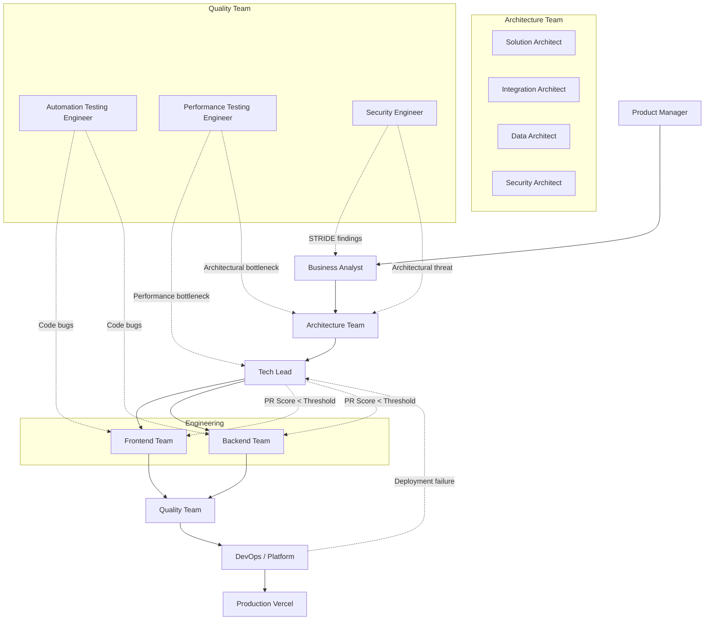

# 🌌 Bluestella Agency Pack

[](https://www.typescriptlang.org/)
[](https://nodejs.org/)
[](https://pnpm.io/)
[](https://vercel.com/)
[](https://opensource.org/licenses/MIT)

Welcome to the **Bluestella Agency Pack** — a structured framework defining a complete, autonomous AI software delivery team. This repository contains the roles, skills, hand-off hooks, instructions, and templates that power product management, business analysis, system architecture, frontend and backend development, quality assurance, and DevOps agents operating inside workspace-aware IDEs.

---

## 🗺️ Workspace Structure

The project separates the **authoring workspace** (root folders) from the **IDE and CI runtimes** (such as `.github/`, `.vscode/`, and local/global IDE configuration directories).

```
bluestella-agency-pack/
├── AGENTS.md                          # AI tool entry point (root source of truth)
├── INIT.md                            # Reference links for writing agents, skills, and hooks
├── PLANS.md                           # Master implementation plan & workflows
├── PLANS_Working Document.md          # Working draft of PLANS.md (do not use as authoritative)
├── concept.excalidraw                 # Architecture concept diagram
├── workspace-sync.py                  # CLI utility to mirror configs into IDE workspaces
│
├── agents/                            # Agent Role Cards (Role & Overview · Responsibilities · Tools · DoD)
│   ├── management/                    # Product Manager, Tech Lead
│   ├── analysis/                      # Business Analyst
│   ├── architecture/                  # Solution, Integration, Data, and Security Architects
│   ├── frontend/                      # React, React Native, SEO, and A11y Engineers
│   ├── backend/                       # Microservices / Serverless Engineer
│   ├── quality/                       # Automation Testing, Performance, and Security Engineers
│   └── devops/                        # DevOps / Platform Engineer
│
├── instructions/                      # Step-by-step procedural guides for recurring tasks
├── hooks/                             # Hand-off trigger conditions and agent feedback loops
├── skills/                            # Reusable prompt skills following agentskills.io spec
│   ├── README.md                      # Skill authoring instructions
│   └── templates/                     # Document templates (BRD, ADR, test plans, bug reports, etc.)
│
├── docs/                              # Standard guidelines and AI generation rules
└── .github/                           # ⚠️ GitHub AI runtime (Managed by sync script, READ-ONLY)
```

---

## 👥 Agent Roster

Each agent has a dedicated **Role Card** located under the [agents/](file:///Users/bluestella/repositories/bluestella-agency-pack/agents) directory specifying their role overview, responsibilities, tool stack, and Definition of Done (DoD).

| Team | Agent Role | Source File |
| :--- | :--- | :--- |
| **Management** | **Product Manager** | [product-manager.md](file:///Users/bluestella/repositories/bluestella-agency-pack/agents/management/product-manager.md) |
| **Management** | **Tech Lead** (PR Gateway) | [tech-lead.md](file:///Users/bluestella/repositories/bluestella-agency-pack/agents/management/tech-lead.md) |
| **Analysis** | **Business Analyst** | [business-analyst.md](file:///Users/bluestella/repositories/bluestella-agency-pack/agents/analysis/business-analyst.md) |
| **Architecture** | **Solution Architect** | [solution-architect.md](file:///Users/bluestella/repositories/bluestella-agency-pack/agents/architecture/solution-architect.md) |
| **Architecture** | **Integration Architect** | [integration-architect.md](file:///Users/bluestella/repositories/bluestella-agency-pack/agents/architecture/integration-architect.md) |
| **Architecture** | **Data Architect** | [data-architect.md](file:///Users/bluestella/repositories/bluestella-agency-pack/agents/architecture/data-architect.md) |
| **Architecture** | **Security Architect** | [security-architect.md](file:///Users/bluestella/repositories/bluestella-agency-pack/agents/architecture/security-architect.md) |
| **Frontend** | **React Engineer** | [react-engineer.md](file:///Users/bluestella/repositories/bluestella-agency-pack/agents/frontend/react-engineer.md) |
| **Frontend** | **React Native Engineer** | [react-native-engineer.md](file:///Users/bluestella/repositories/bluestella-agency-pack/agents/frontend/react-native-engineer.md) |
| **Frontend** | **SEO Engineer** | [seo-engineer.md](file:///Users/bluestella/repositories/bluestella-agency-pack/agents/frontend/seo-engineer.md) |
| **Frontend** | **A11y Engineer** | [a11y-engineer.md](file:///Users/bluestella/repositories/bluestella-agency-pack/agents/frontend/a11y-engineer.md) |
| **Backend** | **Microservices Engineer** | [microservices-engineer.md](file:///Users/bluestella/repositories/bluestella-agency-pack/agents/backend/microservices-engineer.md) |
| **Quality** | **Automation Testing Engineer** | [automation-testing-engineer.md](file:///Users/bluestella/repositories/bluestella-agency-pack/agents/quality/automation-testing-engineer.md) |
| **Quality** | **Performance Testing Engineer** | [performance-testing-engineer.md](file:///Users/bluestella/repositories/bluestella-agency-pack/agents/quality/performance-testing-engineer.md) |
| **Quality** | **Security Engineer** | [security-engineer.md](file:///Users/bluestella/repositories/bluestella-agency-pack/agents/quality/security-engineer.md) |
| **DevOps** | **DevOps / Platform Engineer** | [devops-engineer.md](file:///Users/bluestella/repositories/bluestella-agency-pack/agents/devops/devops-engineer.md) |

---

## 🔄 Agent Workflow & Feedback Loop

The team operates along a top-down delivery pipeline. Requirements flows from Business Analyst down to Architecture, and Tech Lead assigns corresponding frontend/backend development. Once code is submitted, the Quality team validates results, and DevOps deploys. 

When issues are discovered at any stage, hand-off trigger conditions return the issue upstream to resolve gaps.



### Hand-off Hooks

The trigger relationships are managed via files in the [hooks/](file:///Users/bluestella/repositories/bluestella-agency-pack/hooks) directory:

- [architecture-enforcement-api-compliance.md](file:///Users/bluestella/repositories/bluestella-agency-pack/hooks/architecture-enforcement-api-compliance.md)
- [deployment-failure-to-tech-lead.md](file:///Users/bluestella/repositories/bluestella-agency-pack/hooks/deployment-failure-to-tech-lead.md)
- [developer-to-devops-deployment-readiness.md](file:///Users/bluestella/repositories/bluestella-agency-pack/hooks/developer-to-devops-deployment-readiness.md)
- [devops-to-security-infrastructure-audit.md](file:///Users/bluestella/repositories/bluestella-agency-pack/hooks/devops-to-security-infrastructure-audit.md)
- [performance-bottleneck-to-dev-architect.md](file:///Users/bluestella/repositories/bluestella-agency-pack/hooks/performance-bottleneck-to-dev-architect.md)
- [product-manager-tech-lead-roadmap-conflict.md](file:///Users/bluestella/repositories/bluestella-agency-pack/hooks/product-manager-tech-lead-roadmap-conflict.md)
- [qa-systemic-issues-to-tech-lead.md](file:///Users/bluestella/repositories/bluestella-agency-pack/hooks/qa-systemic-issues-to-tech-lead.md)
- [qa-test-findings-to-developer.md](file:///Users/bluestella/repositories/bluestella-agency-pack/hooks/qa-test-findings-to-developer.md)
- [security-finding-to-ba-requirement.md](file:///Users/bluestella/repositories/bluestella-agency-pack/hooks/security-finding-to-ba-requirement.md)
- [security-findings-to-dev-architect.md](file:///Users/bluestella/repositories/bluestella-agency-pack/hooks/security-findings-to-dev-architect.md)
- [tech-lead-pr-score-to-developer.md](file:///Users/bluestella/repositories/bluestella-agency-pack/hooks/tech-lead-pr-score-to-developer.md)
- [tech-lead-to-architecture-technical-debt.md](file:///Users/bluestella/repositories/bluestella-agency-pack/hooks/tech-lead-to-architecture-technical-debt.md)

---

## ⚡ Synchronizing the Workspace

To configure an IDE workspace with these roles and rules, use the [workspace-sync.py](file:///Users/bluestella/repositories/bluestella-agency-pack/workspace-sync.py) utility. This python script mirrors rules in `/agents`, `/skills`, `/hooks`, and `/instructions` to IDE specific destinations.

### Execution

1. **Dry-Run (Default)**: Creates a test layout under `.test/` for inspection before modifying your environment:
   ```bash
   python3 workspace-sync.py
   ```

2. **Apply Changes**: Copies the rules directly to targeted project or global folders:
   ```bash
   python3 workspace-sync.py --apply
   ```

3. **Interactive Configuration**: The script prompts for:
   * **IDE target(s)**: Cursor, Claude Code, VS Code, Windsurf, Trae, or Antigravity.
   * **Install Scope**: Project level (relative to CWD) or Global level (user configuration directory).

---

## 🛡️ Quality Gates & PR Scoring

The **Tech Lead** enforces 7 strict quality gates on every Pull Request. A single red gate fails the review, triggers a bug report, and assigns it back to the developer:

1. **Unit Test Coverage**: Vitest statement, line, branch, and function coverage must be $\ge 90\%$ each.
2. **Type Safety**: TypeScript compiler must report zero errors (`tsc --noEmit`).
3. **Linting**: ESLint checks must return zero errors.
4. **Code Quality**: SonarCloud rules require 0 open major/critical issues, $<3\%$ duplication, and cognitive complexity $\le 15$.
5. **Security Vulnerabilities**: Zero open CVEs (`pnpm audit`), SAST findings, or hardcoded secrets.
6. **QA Bug Checklist**: Zero open bugs at any severity level (P0–P3).
7. **No Debug Artifacts**: Zero instances of `console.log`, `debugger`, or dangling TODOs/FIXMEs.

---

## 🚫 Critical System Boundaries

> [!CAUTION]
> **1. Read-Only GitHub AI Container**
> Do not modify `.github/**` directory directly. The GitHub AI container runtime is populated exclusively by the workspace-sync script.
>
> **2. Roster Integrity**
> Do not create, rename, or delete agent cards under `agents/` unless explicitly instructed.
>
> **3. Database Schema Modifications**
> Do not modify migrations under `db/migrations/**`. Database entries must use soft-deletes; hard-deletes are strictly forbidden.
>
> **4. Stack Constraints**
> Do not introduce any third-party npm libraries outside the approved list (TypeScript, Node.js 20 LTS, pnpm, React, React Native, Vercel Serverless Functions, PostgreSQL, Drizzle ORM, Auth.js v5, Vitest, Playwright, ESLint) without prior explicit human approval.

---

## ✍️ Development Standards & Contributing

For guidelines on writing components, structures, and documents:
* Consult [AI IDE Generation Standards including VSCode.md](file:///Users/bluestella/repositories/bluestella-agency-pack/docs/AI%20IDE%20Generation%20Standards%20including%20VSCode.md) for IDE-assisted generation rules.
* View [AI_IDE_Generation_Templates.md](file:///Users/bluestella/repositories/bluestella-agency-pack/docs/AI_IDE_Generation_Templates.md) to inspect codebase templating.
* Ensure all files follow kebab-case naming.
* Include mandatory YAML frontmatter at the head of every documentation or card file.
