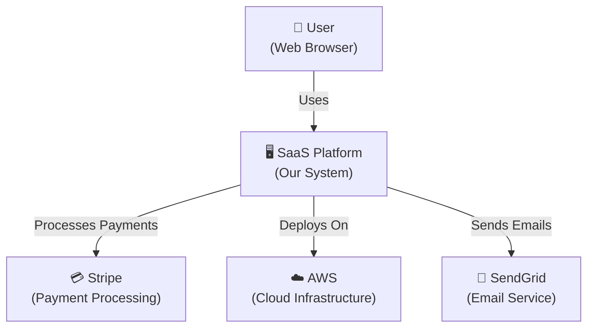
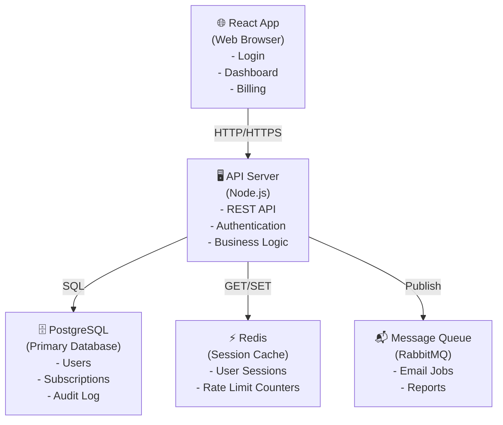
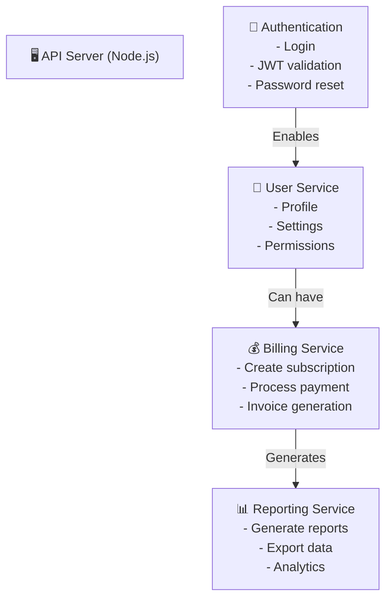
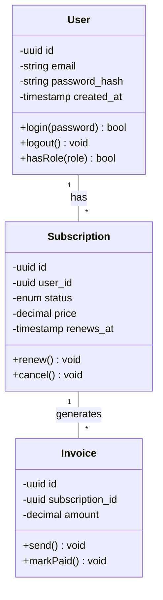

## C4 Model Overview

C4 is a model for visualizing software architecture at 4 levels:

1. **Context (L1):** System boundaries & external systems
2. **Container (L2):** Applications, databases, services
3. **Component (L3):** Major components within a container
4. **Code (L4):** Classes, functions, key abstractions

**Key benefit:** Different stakeholders understand different levels (CEO sees L1; developers see L3-L4)

---

## Level 1: Context Diagram

Shows your system as a black box and external systems it connects to.

### Template

```
User
  ↓
┌─────────────────┐
│  SaaS Platform  │
└─────────────────┘
  ↓       ↓       ↓
[Stripe] [AWS] [Email Service]
```

### Mermaid Example



### When to Use

- Explaining system to executives/stakeholders
- Onboarding new team members
- Understanding external dependencies
- Identifying integration points

---

## Level 2: Container Diagram

Shows major services, databases, and applications within your system.

### Template

```
┌─────────────────────────────────────┐
│         SaaS Platform               │
│                                     │
│  ┌──────────────┐  ┌─────────────┐ │
│  │ React App    │  │ API Server  │ │
│  │ (Browser)    │  │ (Node.js)   │ │
│  └──────────────┘  └─────────────┘ │
│         ↓                   ↓       │
│  ┌──────────────┐  ┌─────────────┐ │
│  │PostgreSQL DB │  │ Redis Cache │ │
│  └──────────────┘  └─────────────┘ │
│                                     │
└─────────────────────────────────────┘
```

### Mermaid Example



### Key Containers

| Container         | Technology          | Purpose            | Examples                       |
| ----------------- | ------------------- | ------------------ | ------------------------------ |
| **Web App**       | React, Vue, Angular | User interface     | Login, Dashboard, Settings     |
| **Mobile App**    | React Native, Swift | Native mobile      | iOS, Android apps              |
| **API Server**    | Node, Python, Java  | Backend            | REST endpoints, business logic |
| **Database**      | PostgreSQL, MySQL   | Persistent storage | Users, products, transactions  |
| **Cache**         | Redis, Memcached    | Session/data cache | User sessions, computed values |
| **Message Queue** | RabbitMQ, Kafka     | Async messaging    | Background jobs, events        |
| **File Storage**  | S3, Google Cloud    | Document storage   | PDFs, images, uploads          |

---

## Level 3: Component Diagram

Shows major components WITHIN a single container (e.g., API Server).

### Template

```
┌──────────────────────────┐
│  API Server (Node.js)    │
│                          │
│  ┌────────────────────┐  │
│  │ Auth Module        │  │
│  │ - Login            │  │
│  │ - Register         │  │
│  └────────────────────┘  │
│          ↓               │
│  ┌────────────────────┐  │
│  │ Subscription Module│  │
│  │ - Create Plan      │  │
│  │ - Bill User        │  │
│  └────────────────────┘  │
│                          │
└──────────────────────────┘
```

### Mermaid Example



### Key Components

For an API server, typical components:

- **Authentication:** Login, JWT validation, OAuth
- **User Management:** Profile, settings, permissions
- **Billing:** Subscriptions, payments, invoices
- **Reporting:** Data export, analytics, dashboards
- **Notifications:** Email, SMS, in-app alerts
- **Admin:** System settings, monitoring, user management

---

## Level 4: Code Diagram

Shows classes, interfaces, and key functions within a component.

### Template (Classes)

```
┌────────────────────────┐
│ User Entity            │
├────────────────────────┤
│ - id: UUID             │
│ - email: string        │
│ - password_hash: string│
├────────────────────────┤
│ + login(password)      │
│ + logout()             │
│ + resetPassword()      │
└────────────────────────┘
     ↑
     │ implements
┌────────────────────────┐
│ IAuthenticatable       │
├────────────────────────┤
│ + authenticate()       │
│ + authorize(role)      │
└────────────────────────┘
```

### Mermaid Example (Class Diagram)



### When to Use Level 4

- Explaining critical business logic to developers
- Onboarding new developers
- Documenting complex algorithms
- Preparing for code review

---

## Best Practices

1. **Start with L1 & L2:** Usually sufficient for architecture decisions
2. **Use colors consistently:** External systems one color, internal another
3. **Show data flow:** Arrows show request/response, not just connection
4. **Label relationships:** What data flows? (HTTP, SQL, async message)
5. **Keep it readable:** Not all boxes on one diagram; break into multiple
6. **Version control:** Store .excalidraw or Mermaid in git
7. **Update regularly:** Keep diagrams in sync with actual architecture

---

## Tools

- **Excalidraw:** Visual diagramming (excalidraw.com)
- **Mermaid:** Markdown-based diagrams (supports git, version control)
- **Draw.io:** Free, browser-based
- **Lucidchart:** Paid, professional
- **C4-PlantUML:** PlantUML for C4 diagrams

**Recommendation:** Start with Mermaid (simpler, version control friendly), upgrade to Excalidraw for detailed diagrams.

---

## Architecture Diagram Checklist

- [ ] All external systems shown
- [ ] All containers clearly labeled
- [ ] Data flow direction clear (arrows with labels)
- [ ] Technology stack identified (Node, React, PostgreSQL, etc.)
- [ ] Key databases and services included
- [ ] Authentication flows shown (if relevant)
- [ ] Scaling/deployment info noted (if relevant)
- [ ] Matches current system (not aspirational future design)

---

## Anti-Patterns

❌ Don't:

- Show every tiny component (keep it simple)
- Mix multiple abstraction levels in one diagram (confusing)
- Forget to label relationships (what data flows between boxes?)
- Make it too pretty (readability > aesthetics)
- Create diagrams that don't match reality (causes trust issues)

✅ Do:

- Start simple (L1), add detail (L2, L3) as needed
- Update diagrams when architecture changes
- Get feedback from team (make sure it matches their mental model)
- Link to documentation (explain non-obvious components)
