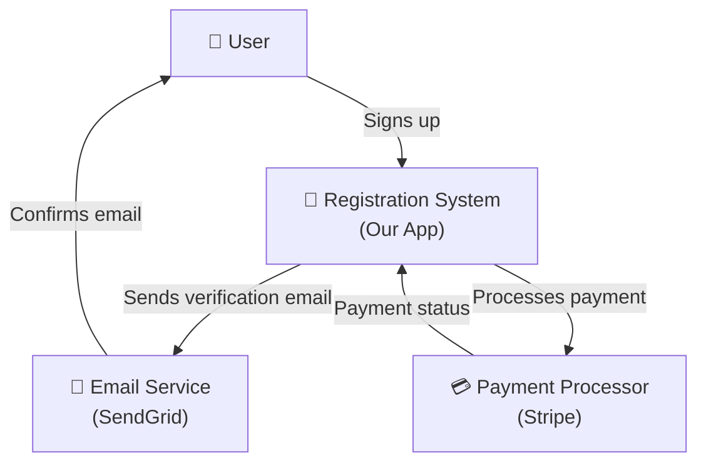
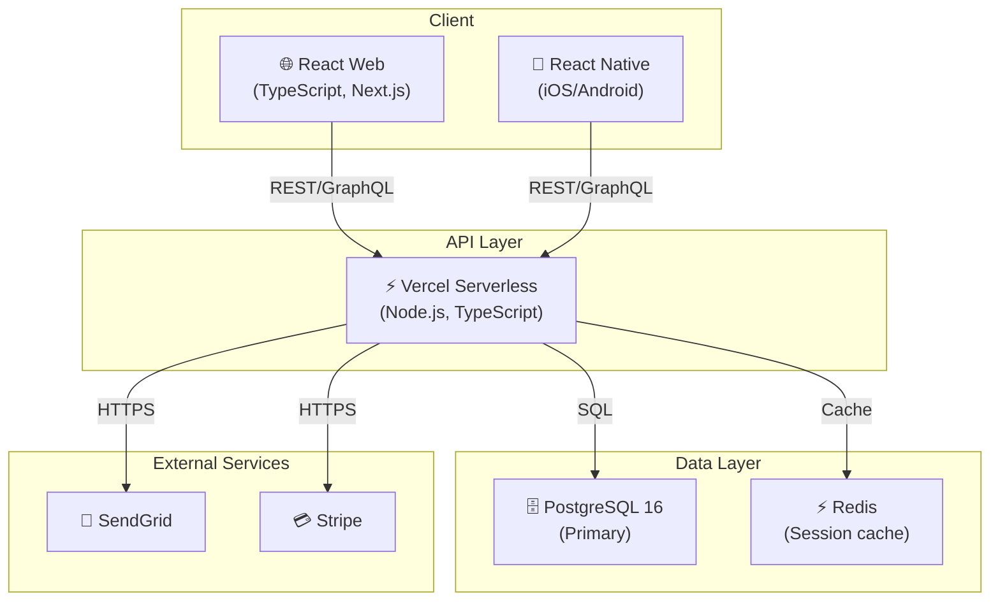
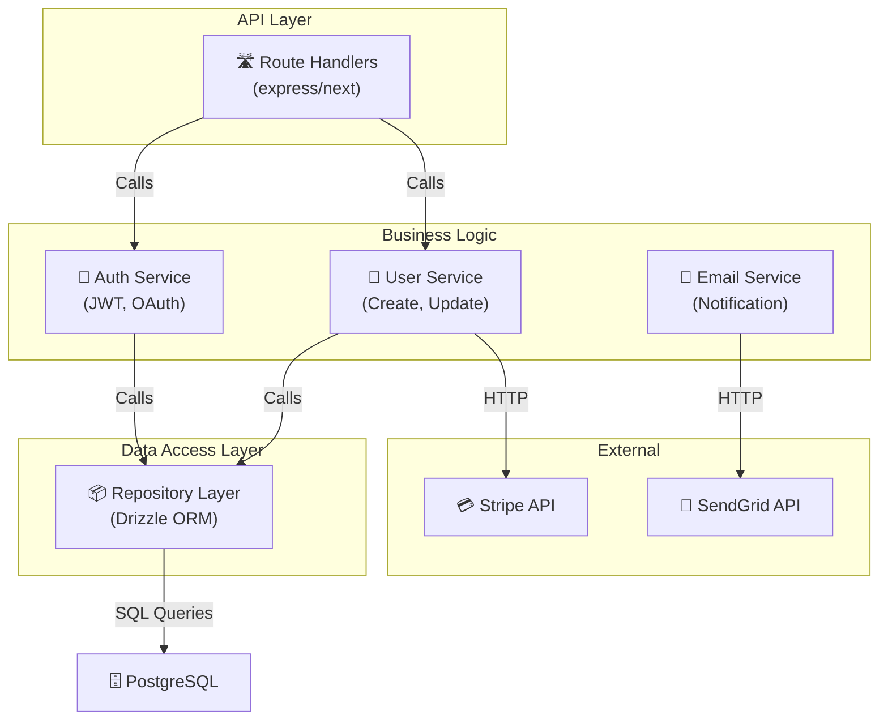
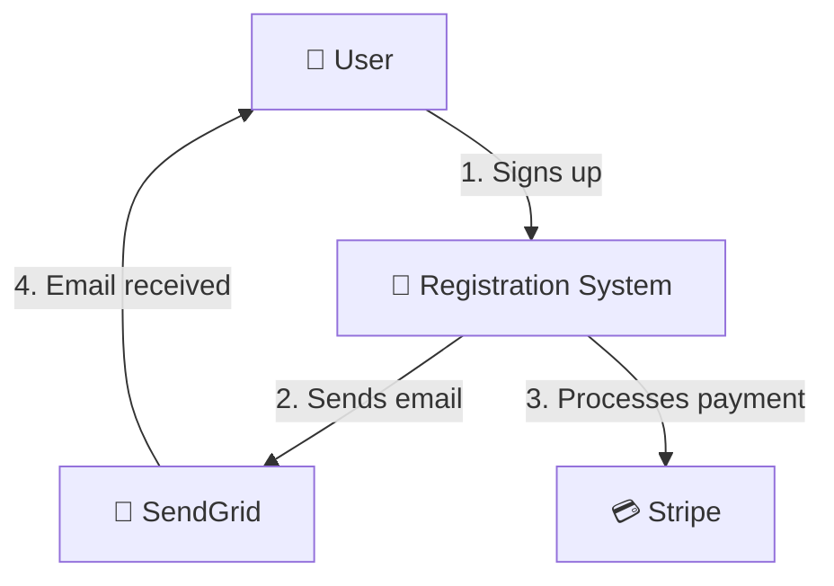
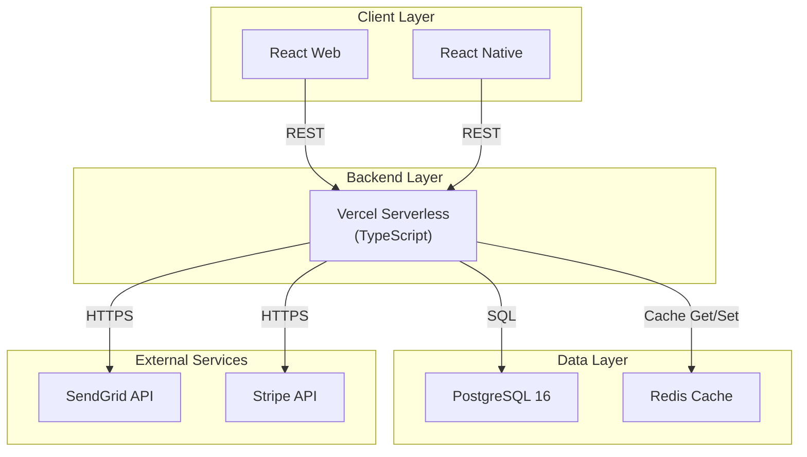
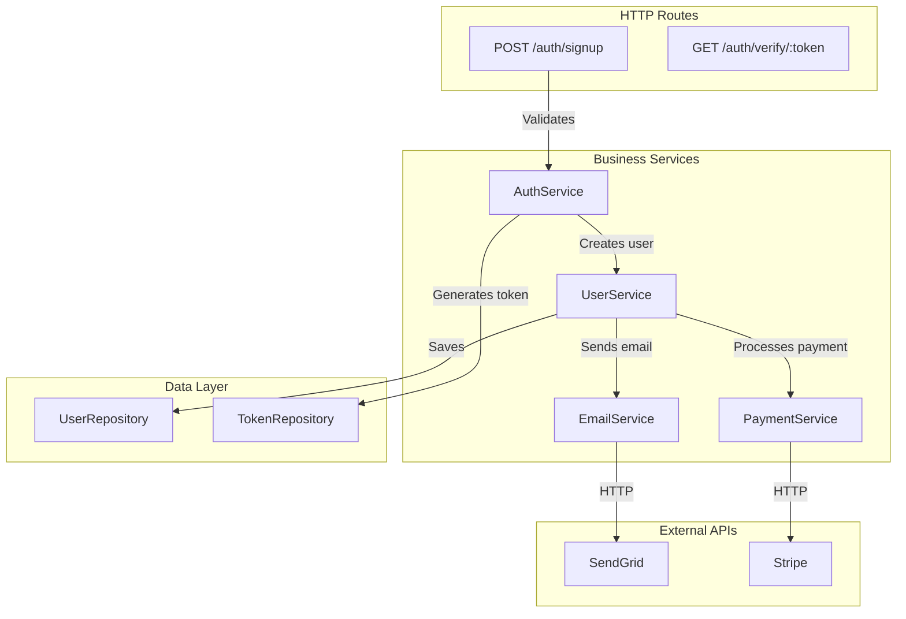
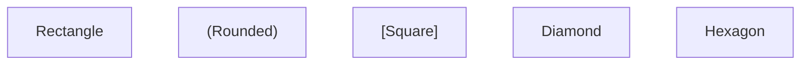
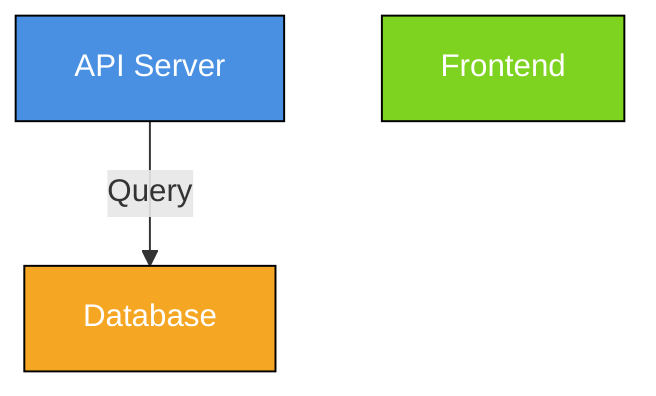
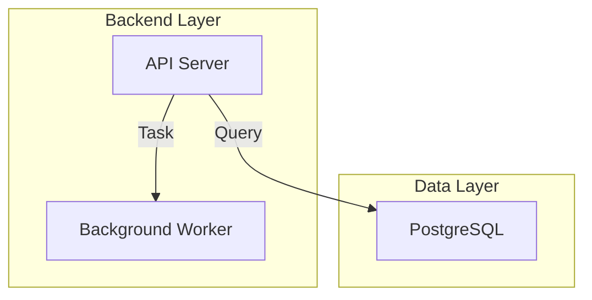

# C4 Architecture Diagramming Skill

## Overview

The C4 model is a hierarchical approach to visualizing software architecture at four levels of abstraction:

1. **Context** — System in relation to other systems and users
2. **Container** — High-level building blocks (frontend, backend, database, etc.)
3. **Component** — Internal structure of containers
4. **Code** — Implementation details (classes, functions)

This skill helps architects create clear, consistent architecture diagrams using Mermaid.js.

---

## Level 1: System Context

**Purpose:** Show what the system does and who uses it (no technical details)

**Elements:**

- The system being built (centered box)
- External users and systems it interacts with
- High-level data flows

**Mermaid Syntax:**



**Questions to Answer:**

- Who are the main users/actors?
- What external systems does this integrate with?
- What are the primary data flows?

---

## Level 2: Container Architecture

**Purpose:** Show the major building blocks and technology choices

**Elements:**

- Containers (frontend, backend, database, cache, etc.)
- Technology choices for each container
- Communication protocols between containers

**Mermaid Syntax:**



**Questions to Answer:**

- What are the major technology components?
- How do they communicate (HTTP, gRPC, events)?
- What database/cache tech is used?
- What third-party services are integrated?

---

## Level 3: Component Architecture

**Purpose:** Show the internal structure of a container

**Elements:**

- Components (layers, services, modules)
- Component interactions
- Data flow within the container

**Mermaid Syntax (Backend Example):**



**Questions to Answer:**

- What are the main layers (API, Business Logic, Data Access)?
- What services/modules exist?
- How do they interact?
- What external APIs are called?

---

## Level 4: Code Architecture

**Purpose:** Show implementation details (classes, functions, design patterns)

This is typically documented in code comments, TypeScript interfaces, or a separate design document. Not usually drawn as a diagram, but rather represented as type definitions:

```typescript
// API Routes
interface SignupRequest {
  email: string;
  password: string;
}

interface SignupResponse {
  user: User;
  token: string;
}

// Business Logic
class AuthService {
  async signup(req: SignupRequest): Promise<SignupResponse> {
    // Validate input
    // Hash password
    // Create user in DB
    // Send verification email
    // Return token
  }
}

// Data Access
class UserRepository {
  async create(user: User): Promise<User>;
  async findByEmail(email: string): Promise<User | null>;
  async update(id: string, user: Partial<User>): Promise<User>;
}
```

---

## Complete C4 Example: User Registration System

### Level 1: System Context



### Level 2: Container Architecture



### Level 3: Component (Backend)



---

## Best Practices

1. **Start at Level 1:** Always begin with context. Don't assume readers know the system.
2. **One diagram per level:** Each level should be a separate diagram for clarity.
3. **Technology in containers:** Specify which tech is used (React, PostgreSQL, etc.).
4. **Data flow arrows:** Label arrows with data type or protocol (REST, SQL, gRPC).
5. **Consistency:** Use same shape/color for similar component types.
6. **Simplify:** Don't include every internal function; keep components at service/module level.
7. **Audience:** C1 for executives, C2 for team leads, C3-C4 for engineers.

---

## Mermaid Tips

**Node Types:**



**Styling:**



**Subgraph (Grouping):**



---

## C4 Architecture Document Template

```markdown
# C4 Architecture: [System Name]

## Level 1: System Context

[Mermaid diagram or description]

**What it shows:**

- [System user groups]
- [External integrations]
- [High-level flows]

**Key decision:**

- [Tech choice or architectural decision]

---

## Level 2: Container Architecture

[Mermaid diagram]

**Containers:**

1. [Container Name] — [Tech stack] — [Purpose]
2. [Container Name] — [Tech stack] — [Purpose]

**Communication:**

- Frontend → Backend: REST/GraphQL over HTTPS
- Backend → Database: SQL over encrypted connection

---

## Level 3: Component (Backend Example)

[Mermaid diagram]

**Services:**

- [Service Name]: [Responsibility]
- [Service Name]: [Responsibility]

**Data Flow:**
[Description of how data flows through services]

---

## Architecture Decisions

| Decision                  | Rationale                                 | Alternatives                 | Trade-offs                       |
| ------------------------- | ----------------------------------------- | ---------------------------- | -------------------------------- |
| PostgreSQL for primary DB | ACID compliance, complex queries          | MongoDB, DynamoDB            | Less flexible schema changes     |
| Redis for sessions        | Fast in-memory, supports expiration       | Database, Memcached          | Requires separate infrastructure |
| Vercel Serverless         | Automatic scaling, managed infrastructure | Docker on EC2, GCP Cloud Run | Vendor lock-in, cold starts      |

---

## Deployment Topology

[Show how components map to infrastructure: Vercel, RDS, ElastiCache, etc.]

---

## Scalability & Performance

- Frontend: CDN caching, automatic scaling
- Backend: Vercel auto-scaling, connection pooling
- Database: Read replicas, caching layer

---

## References

- [C4 Model Official](https://c4model.com/)
- [Mermaid Docs](https://mermaid.js.org/)
- [Architecture Decision Records (ADRs)](https://adr.github.io/)
```

---

## References

- [C4 Model by Simon Brown](https://c4model.com/)
- [Mermaid.js Documentation](https://mermaid.js.org/)
- [Architecture Decision Records (ADRs)](https://adr.github.io/)
- [System Design Handbook](https://www.systemdesignhandbook.com/)
