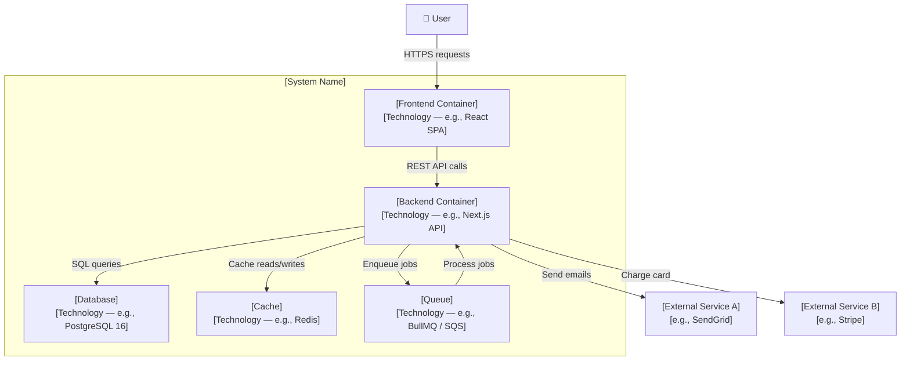
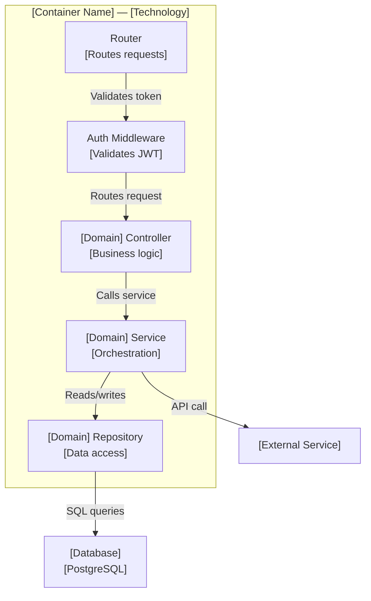
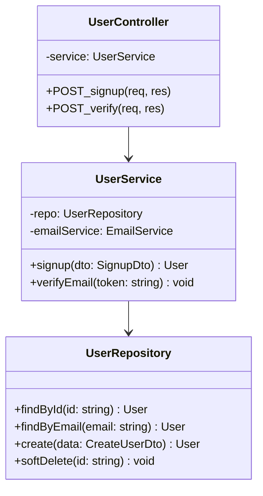

# C4 Diagram Templates (Mermaid.js)

## Level 1 — System Context

```mermaid
graph TB
    User["👤 [User Role]<br/>[e.g., End User]"]
    ExternalA["📧 [External System A]<br/>[e.g., Email Service / SendGrid]"]
    ExternalB["💳 [External System B]<br/>[e.g., Payment Processor / Stripe]"]

    System["🎯 [System Name]<br/>[Short description]"]

    User -->|[Action — e.g., Signs up]| System
    System -->|[Action — e.g., Sends verification email]| ExternalA
    System -->|[Action — e.g., Processes payment]| ExternalB
    ExternalA -->|[Response — e.g., Confirms email]| User
    ExternalB -->|[Response — e.g., Payment status]| System
```

**Questions answered by this diagram:**
- Who are the main users or actor types?
- What external systems does this integrate with?
- What are the primary data flows in and out?

---

## Level 2 — Container Architecture



**Questions answered by this diagram:**
- What are the major technical building blocks?
- What technology does each container use?
- How do containers communicate (HTTP, SQL, queue)?

---

## Level 3 — Component (within one container)



**Questions answered by this diagram:**
- What are the internal modules/layers of this container?
- How do components depend on each other?
- Which component touches the database or external services?

---

## Level 4 — Code (Class / Sequence — use sparingly)



**Use Level 4 when:**
- Onboarding new developers to complex domain logic
- Documenting a critical class hierarchy
- Otherwise, let the IDE generate this (e.g., VS Code class diagrams extension)
