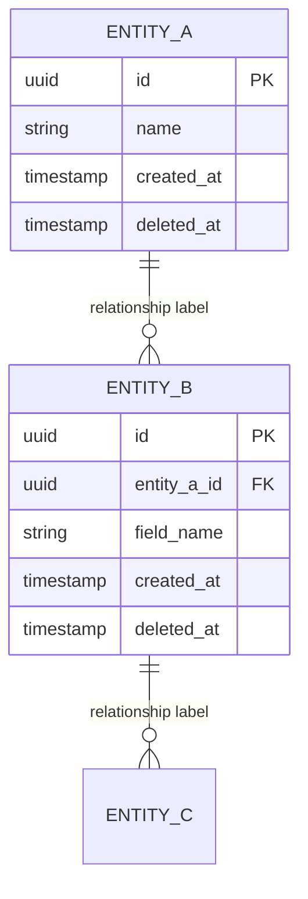

# Database Schema Design: [Feature Name]

**Version:** 1.0
**Date:** [YYYY-MM-DD]
**Owner:** Data Architect
**Related Ticket:** [Feature / Epic link]

---

## Business Context

[Describe the business problem and data requirements in 2–3 sentences.]

**Key Requirements:**
- [ ] [e.g., Multi-tenancy — organizations with multiple users]
- [ ] [e.g., GDPR compliance — right to erasure, data residency]
- [ ] [e.g., Soft deletes — never hard-delete financial records]
- [ ] [e.g., Performance — 1M users, 5K req/sec]
- [ ] [e.g., Audit trail — track all changes to sensitive data]

---

## ERD

---

## Table Definitions

### [table_name]

| Column       | Type         | Constraints              | Index | Purpose                          |
| ------------ | ------------ | ------------------------ | ----- | -------------------------------- |
| id           | uuid         | PK                       | ✅ PK | Unique identifier                |
| [column]     | [type]       | [NOT NULL / NULL / UK]   | [✅/❌] | [Why this column exists]        |
| created_at   | timestamp    | NOT NULL, DEFAULT NOW()  | ✅    | Record creation timestamp        |
| deleted_at   | timestamp    | NULL                     | ✅    | Soft-delete (NULL = active)      |

**Indexes:**
- PRIMARY KEY (id)
- [UNIQUE (column) — reason]
- [INDEX (col1, col2) — query pattern served]

**Constraints:**
- [FOREIGN KEY (col) REFERENCES table(col) ON DELETE CASCADE]
- [CHECK (col IN ('value1', 'value2'))]

**Notes:**
- [Any design decisions, PII flags, encryption requirements]

---

## Normalization Analysis

**Normal Form:** [1NF / 2NF / 3NF / BCNF]

**Assessment:**
- ✅ [What's normalized]
- ⚠️ [Any intentional denormalization with reason]

**Denormalization Opportunities:**
- [Column X cached from Table Y — reason: avoids N+1 query in hot path]

---

## Data Governance

### Ownership

| Table    | Business Owner  | Technical Owner |
| -------- | --------------- | --------------- |
| [table]  | [team/role]     | [team/role]     |

### PII Fields

| Table  | Column      | PII Type           | Encryption         |
| ------ | ----------- | ------------------ | ------------------ |
| users  | email       | Contact info       | DB encryption only |
| users  | first_name  | Personal data      | DB encryption only |
| [...]  | [...]       | [...]              | [App-level AES?]   |

### Data Retention

| Table    | Retention Period | Policy                                  |
| -------- | ---------------- | --------------------------------------- |
| [table]  | [e.g., 7 years]  | [Soft-delete / Anonymize / Hard-delete] |

### Access Control

| Table    | Admin | Authenticated User | Service Account |
| -------- | ----- | ------------------ | --------------- |
| [table]  | Full  | [Read own only]    | [Read]          |

---

## GDPR Compliance

- [ ] Right to erasure: soft-delete implemented via `deleted_at`
- [ ] Right to data portability: user data queryable via `audit_log`
- [ ] PII fields identified and listed above
- [ ] PII encrypted at rest (application-level for sensitive fields)
- [ ] Data residency: all data stored in [region]
- [ ] DPA signed with all third-party processors

---

## Indexing Strategy

| Table   | Index Definition                      | Serves Query Pattern             |
| ------- | ------------------------------------- | -------------------------------- |
| [table] | INDEX (org_id, deleted_at)            | List active records per org      |
| [table] | UNIQUE (org_id, email)                | Enforce unique email per org     |
| [table] | INDEX (renews_at)                     | Find records due for renewal     |

---

## Migration Plan _(if replacing existing schema)_

- [ ] **Phase 1 — Prep:** Create new schema in staging; write migration scripts; test ≥3 times
- [ ] **Phase 2 — Dual-write:** Write to both old and new schema simultaneously; verify consistency
- [ ] **Phase 3 — Cutover:** Stop writes to old schema; final sync; redirect reads to new schema
- [ ] **Phase 4 — Cleanup:** Remove old schema after 30-day safety period

**Rollback plan:** [How to revert if Phase 3 fails]

---

## Sign-Off

- [ ] Data Architect: ______________ Date: ______
- [ ] Backend Lead: ______________ Date: ______
- [ ] Compliance / Legal: ______________ Date: ______
