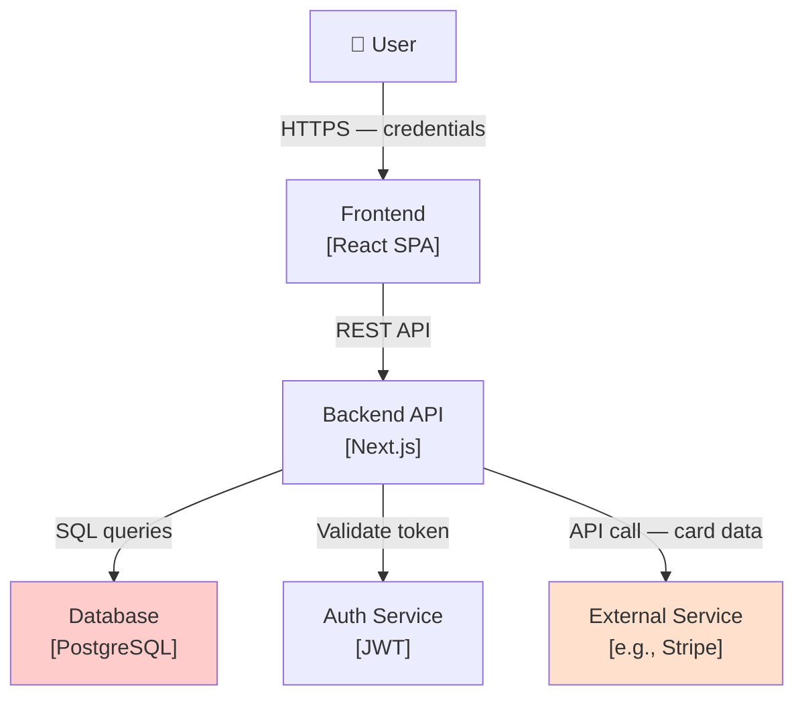

# STRIDE Threat Model: [System Name]

**Date:** [YYYY-MM-DD]
**Author:** [Security Architect / Security Engineer]
**Scope:** [Which components are in scope]
**Related:** [BRD, ADR, or Architecture doc link]

---

## Components in Scope

1. [Component A] — [Brief description, e.g., "React SPA — user-facing frontend"]
2. [Component B] — [e.g., "Next.js API — REST backend, handles auth and data"]
3. [Component C] — [e.g., "PostgreSQL — primary data store, contains PII"]
4. [External A] — [e.g., "Stripe — payment processor, receives card data"]

---

## Data Flow Diagram

_Red = data store, Orange = external trust boundary_

---

## Threats by Category

### Spoofing (S)

| ID  | Threat                             | Component | Likelihood | Impact   | Severity | Mitigation                              | Status     |
| --- | ---------------------------------- | --------- | ---------- | -------- | -------- | --------------------------------------- | ---------- |
| S1  | [e.g., Forged JWT token]           | [BE]      | Medium     | High     | High     | [e.g., Verify signature + expiry]       | Implemented|
| S2  | [e.g., Phishing — fake login page] | [FE]      | Low        | High     | Medium   | [e.g., HSTS, CSP headers]               | Planned    |

### Tampering (T)

| ID  | Threat                             | Component | Likelihood | Impact   | Severity | Mitigation                              | Status     |
| --- | ---------------------------------- | --------- | ---------- | -------- | -------- | --------------------------------------- | ---------- |
| T1  | [e.g., API request tampered MITM]  | [BE]      | Low        | High     | Medium   | [e.g., HTTPS only, HSTS]                | Implemented|

### Repudiation (R)

| ID  | Threat                             | Component | Likelihood | Impact   | Severity | Mitigation                              | Status     |
| --- | ---------------------------------- | --------- | ---------- | -------- | -------- | --------------------------------------- | ---------- |
| R1  | [e.g., No audit log for payments]  | [DB]      | Medium     | High     | High     | [e.g., Append-only audit_log table]     | Planned    |

### Information Disclosure (I)

| ID  | Threat                             | Component | Likelihood | Impact   | Severity | Mitigation                              | Status     |
| --- | ---------------------------------- | --------- | ---------- | -------- | -------- | --------------------------------------- | ---------- |
| I1  | [e.g., PII in error messages]      | [BE]      | Medium     | High     | High     | [e.g., Generic error responses]         | Planned    |

### Denial of Service (D)

| ID  | Threat                             | Component | Likelihood | Impact   | Severity | Mitigation                              | Status     |
| --- | ---------------------------------- | --------- | ---------- | -------- | -------- | --------------------------------------- | ---------- |
| D1  | [e.g., No rate limit on /login]    | [BE]      | High       | High     | Critical | [e.g., 5 req/IP/min rate limit]         | Not Started|

### Elevation of Privilege (E)

| ID  | Threat                             | Component | Likelihood | Impact   | Severity | Mitigation                              | Status     |
| --- | ---------------------------------- | --------- | ---------- | -------- | -------- | --------------------------------------- | ---------- |
| E1  | [e.g., SQLi → admin access]        | [BE/DB]   | Low        | Critical | High     | [e.g., Parameterized queries, ORM]      | Implemented|

---

## Risk Register

### Critical (Must Mitigate — block release)

- **[D1]:** [Threat description] → **Action:** [Mitigation] — Owner: [Name], Due: [Date]

### High (Should Mitigate — fix this sprint)

- **[S1]:** [Threat description] → **Action:** [Mitigation] — Owner: [Name], Due: [Date]
- **[R1]:** [Threat description] → **Action:** [Mitigation] — Owner: [Name], Due: [Date]

### Accepted Risk (explicit sign-off required)

- **[ID]:** [Threat] — **Rationale:** [Why accepted, not mitigated] — **Accepted by:** [Name, Date]

---

## Sign-Off

- [ ] Security Architect: ______________ Date: ______
- [ ] Tech Lead: ______________ Date: ______
- [ ] CTO/Exec _(Critical accepted risks only)_: ______________ Date: ______
